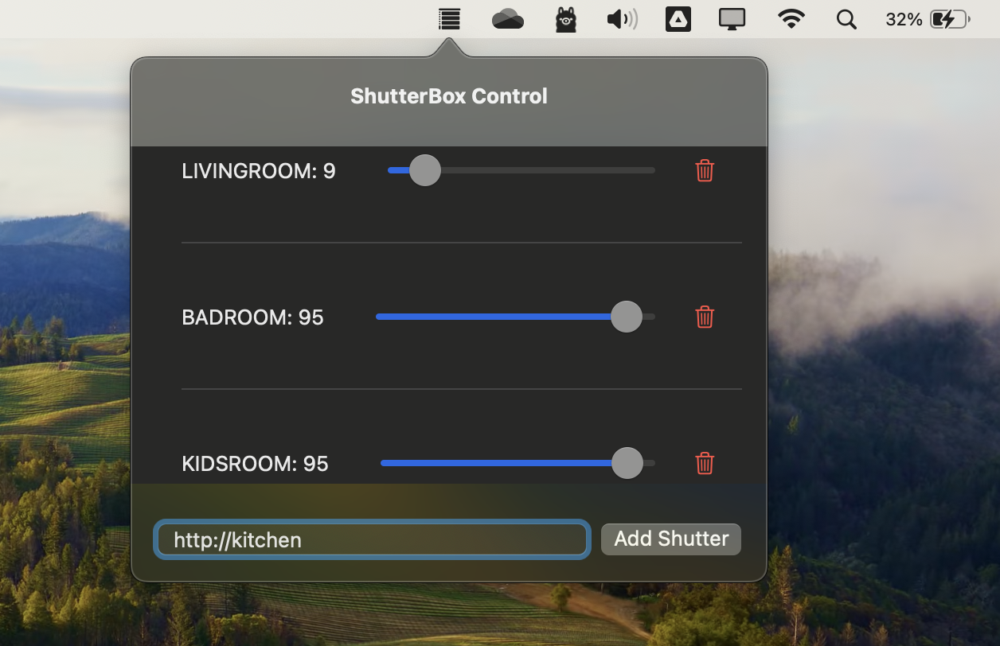

# BleboxShutterControl
#### Please note that this is a weekend project created out of a desire to learn Xcode and explore whether, with the help of AI, I can develop a simple macOS application.
#### BleboxShutterControl is a macOS application for controlling shutters (shutterbox) by Blebox company. The application works exclusively from the status bar, allowing users to add, remove, and adjust the position of shutters. Application uses the local [API issued by shutterbox](https://technical.blebox.eu/openapi_shutterbox/openAPI_shutterBox_20190911.html) roller shutter controllers 



## Installation

#### Download Binaries

You can download the latest pre-production binaries from the [Releases](https://github.com/kmkamyk/BleboxShutterControl/releases) section.

#### Installation Steps

1. Download the binary file from the [Releases](https://github.com/kmkamyk/BleboxShutterControl/releases) section.
2. Unzip the downloaded file if it is compressed.
3. Move the `ShutterBoxControl.app` to your `Applications` folder.
4. Open the `ShutterBoxControl.app` from your `Applications` folder.

### Build from Source

1. Clone the repository:
    ```bash
    git clone https://github.com/kmkamyk/BleboxShutterControl.git
    ```

2. Open the Xcode project:
    ```bash
    open Project/ShutterBoxControl.xcodeproj
    ```

3. Build the project in Xcode:
    - Select the `ShutterBoxControl` scheme.
    - Select your target device or `My Mac`.
    - Press `Cmd + R` to build and run the application.

## Features

- Add new shutters using their URL
- Remove existing shutters
- Adjust shutter positions using sliders
- Automatically save and load shutters from a JSON file
- Fetch and display current shutter positions
- Periodically refresh shutter positions every 5 seconds

## Usage

1. When the application starts, it will appear in the macOS status bar.

2. To add a new shutter:
    - Enter the shutter's base URL in the text field at the bottom of the application window.
    - Click "Add Shutter".

3. To adjust a shutter's position:
    - Use the slider next to the shutter's position label.
    - The position will update in real-time.

4. To remove a shutter:
    - Click the trash icon next to the corresponding shutter.

## License

This project is licensed under the GNU 3.0 - see the [LICENSE](LICENSE) file for details.
